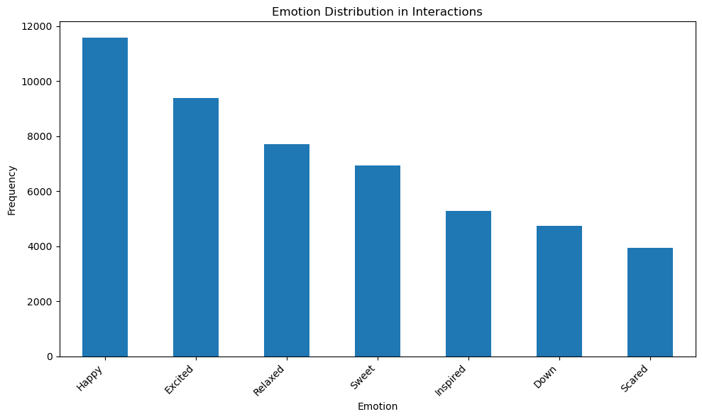
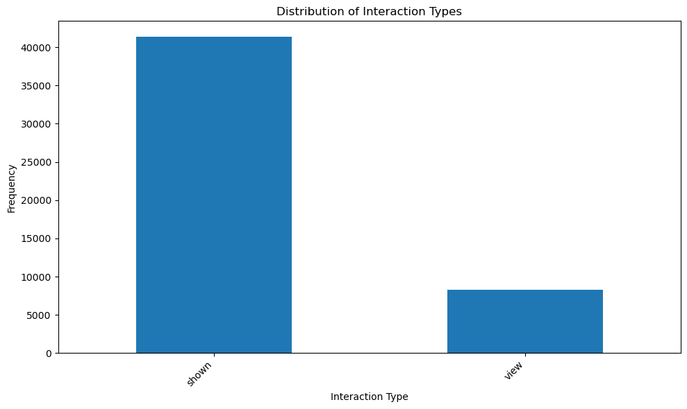
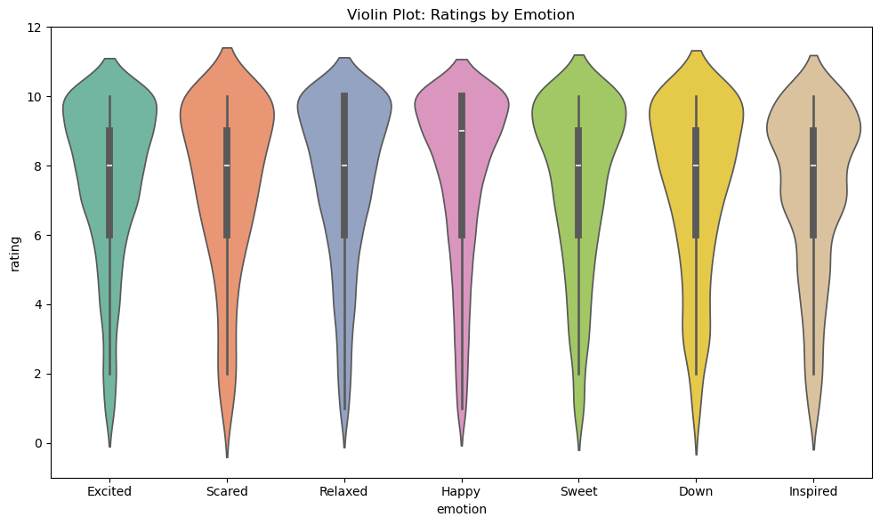
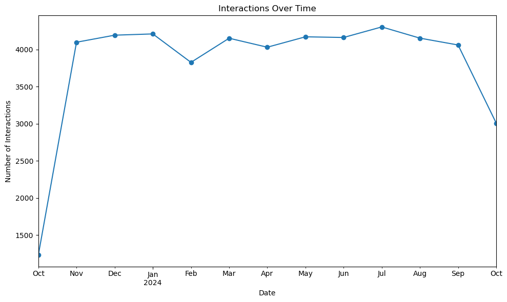

# 🎬 Feelms - Predict by Emotion

Welcome to **Feelms**, a movie recommendation app that suggests films based on your emotions! This app leverages collaborative filtering and machine learning models to predict your favorite movies and ratings, all while interacting with a MySQL database hosted on AWS.

## 📌 Features

- **Emotion-based Recommendations**: Choose your current mood, and Feelms will recommend movies that match your emotions (e.g., Happy, Excited, Relaxed).
- **User Authentication**: Securely create or log into your account.
- **Movie Ratings & Favorites**: Rate your favorite movies and save them to a personalized favorites list.
- **Machine Learning Models**:
  - **SVD (Collaborative Filtering)**: Provides personalized movie ratings based on user interaction.
  - **Random Forest Classifier**: Predicts whether a movie will be favorited by a user, based on features like duration and ratings.
- **Streamlit UI**: Simple, intuitive web interface powered by [Streamlit](https://streamlit.io/) for seamless interaction with the recommendation system.

## 🔬 How It Works

### ✅ 1. Data Processing

- **Movie Dataset (`imdb.csv`)**: The original dataset from Kaggle contains basic information such as title, director, cast, genres, and poster images. This data was processed in the notebook `imdb.ipynb` to produce two key outputs:
  - **`imdb_clean.csv`**: A refined version of the movie dataset with enhanced, ready-for-model features, including an additional emotion-based column.
  - **Emotion Mapping**: Using a custom dictionary, genres were mapped to specific emotions (e.g., *Comedy* to *Happy*, *Horror* to *Scared*), creating an emotion field for each movie, which enables tailored recommendations based on user-selected emotions.

- **Generated Datasets for Interactions**: To simulate realistic interaction data for the machine learning models, a data generation script produces the following datasets:
  - **Users** (`users.csv`): A simulated user base with sequential IDs, usernames, and passwords, representing 1,000 users split into active (20%) and less active (80%) groups.
  - **Interactions** (`interactions.csv`): Simulated interactions between users and movies with emotions selected based on weighted probabilities, representing different engagement types (view or shown).
  - **Favorites** (`favorites.csv`): Generated from a subset (30%) of viewed movies that were marked as favorites, with favorite dates occurring after the original view date.
  - **Ratings** (`ratings.csv`): Assigned ratings to 50% of favorites, with ratings influenced by the associated emotion, reflecting a realistic distribution of user preferences.
   
### 🧠 2. Machine Learning Models

#### **SVD (Singular Value Decomposition)**

- This model is used for collaborative filtering to predict user ratings on movies. Key hyperparameters (e.g., `n_factors = 100`, `lr_all = 0.005`) were adjusted for optimal recommendation accuracy.
- Cross-validation with metrics like RMSE and MAE was applied to evaluate and fine-tune the model's performance on interaction data.

#### **Random Forest Classifier**

- The Random Forest model predicts whether a movie will become a favorite based on features such as duration and rating. The model was optimized for accuracy, precision, and recall using cross-validation and hyperparameter tuning (e.g., `max_depth = 15`).
- The model integrates into Streamlit as a predictive tool to suggest movies that users are likely to favor.

### 🌐 3. AWS Integration

- **RDS (Relational Database Service)**: A MySQL database on Amazon RDS stores user interactions, favorites, and ratings.
- **EC2 (Elastic Compute Cloud)**: The app is hosted on an EC2 instance, providing a scalable and high-availability environment for the app.
- **Environment Variables**: Sensitive information like database credentials is stored securely in Streamlit's `secrets.toml` file.

### 🚀 4. Streamlit Application

The web app uses Streamlit for real-time interaction, displaying movie recommendations, ratings, and favorites through an intuitive UI. Pre-trained model files (`rf_model.pkl`, `svd_model.pkl`) are integrated directly into the Streamlit app for immediate use.

## 📁 Project Structure

- **`data/`**: Contains CSV files, including the original movie dataset, cleaned data, and generated datasets (`favorites`, `interactions`, `ratings`, `users`, `imdb_clean`).
- **`lib/`**: Includes Python scripts for data processing and machine learning functions:
  - **`data_analysis.py`**: EDA for generated interaction data.
  - **`data_generation.py`**: Functions to generate users, interactions, favorites, and ratings.
  - **`imdb_data_analysis.py`**: EDA for the initial movie dataset.
  - **`imdb_data_cleaning.py`**: Cleaning and transformation functions for `imdb.csv`.
  - **`ml.py`**: Machine learning functions for SVD and Random Forest models.
- **`model/`**: Stores trained models as `.pkl` files (`rf_model.pkl`, `svd_model.pkl`) for Streamlit integration.
- **`notebook/`**: Jupyter notebooks executing each stage:
  - **`data.ipynb`**: Generates data and EDA on interactions.
  - **`imdb.ipynb`**: Performs cleaning and EDA on the movie dataset.
  - **`ml.ipynb`**: Executes and evaluates ML models.
- **`app.py`**: Streamlit application that connects to AWS, uses the trained models, and serves as the user interface.
- **`README.md`**: Documentation for the project.
- **`requirements.txt`**: Dependencies needed for the project.

## ⚙️ Installation

To run this project locally, follow these steps:

1. Clone the repository:

   ```bash
   git clone https://github.com/yourusername/feelms.git
   cd feelms

2. Install de required dependencies:

   ```bash
   pip install -r requirements.txt

3. Set up the environment variables:

   Streamlit's secrets manager is used to store sensitive information like the database credentials. Add the following to `.streamlit/secrets.toml`:

   ```toml
   [database]
   DB_HOST = "your-db-host"
   DB_USER = "your-db-user"
   DB_PASSWORD = "your-db-password"
   DB_NAME = "your-db-name"
   DB_PORT = "your-db-port"

4. Run the Streamlit app:
   ```bash
   streamlit run app.py

## 💡 Usage

Once the app is running:

1. **Login** or **Register** as a new user.
2. Choose an **emotion** from the list provided (e.g., Happy, Excited, Relaxed).
3. Browse through the movie recommendations.
4. **Rate movies** and **add them to your favorites**.
5. Enjoy your personalized movie experience!

## 📊 EDA and Data Generation Insights

- **Emotion Weights**: Positive emotions (e.g., Happy, Excited) were assigned higher weights in the generated interactions, increasing their frequency in recommendations to reflect user preferences for uplifting content.

  

- **Active vs. Casual Users**: About 20% of users are classified as active and engage with the platform frequently, while the other 80% are casual users, simulating real-world application usage patterns.

  

- **Favorites and Ratings**: Only about 30% of movies viewed are marked as favorites, and ratings are applied to 50% of those favorites. This setup models selective engagement, where users may choose to rate only the most impactful movies.

  

- **Interaction Dates**: Dates of interactions are randomly distributed within the last year, generating realistic activity trends over time.

  

- **Validation through EDA**: Exploratory Data Analysis was performed on both the initial movie dataset and the generated interaction data to ensure data quality, consistency, and appropriate distribution for modeling.

## 🔍 Future Enhancements

- Incorporate additional machine learning models to improve recommendation accuracy.
- Extend functionality to include TV series and documentaries.
- Implement user-based filtering to improve collaboration between users with similar preferences.
